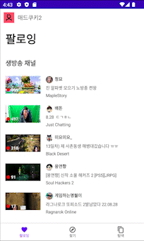
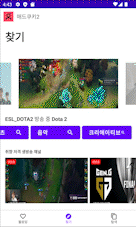
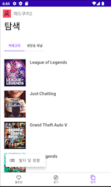

> This project can't build without twitch developer settings and firebase auth settings. but you can run this app with apk file on release note.

 

Using [Twitch Api](https://dev.twitch.tv/docs/api/), I made a **twitch clone app**.

 

## Feature
- Twitch Sign in
- Show Live stream whoes user follow
- Show random Live Streams
- Show Broadcasters who user follow
- Show Top popular games on twitch
- Show Just Chatting streams
- Show Clips
- Show Categories

> This app can't play video or show chat. but just shows a thumbnail of the video. cuz Twitch API does not support it.

## Tech Stack
- Jetpack compose
- dagger-hilt
- coroutine
- retrofit
- firebase auth
- glide
- deep link (for twitch auth redirection)

